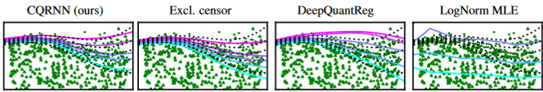

## Censored Quantile Regression Neural Networks for Distribution-Free Survival Analysis
Code from NeurIPS 2022 paper 'Censored Quantile Regression Neural Networks for Distribution-Free Survival Analysis' - https://arxiv.org/abs/2205.13496



## Code Description

Brief overview of each script's purpose.

- ```01_code/algorithms.py```
    : Training loop for models.
- ```01_code/datasets.py```
    : Downloading/processing/generation of all datasets.
- ```01_code/hyperparams.py```
    : Hyperparameters used in main benchmarking experiments (Table 4 of paper).
- ```01_code/models.py```
    : Neural network architectures and custom losses for CQRNN, seq. grid, LogNorm MLE.
- ```01_code/script_exp.py```
    : Main experimental script to fire everything from.
- ```01_code/utils.py```
    : Specify paths, plotting functions, metric functions etc.
- ```02_datasets/```
    : We provide raw datafiles for the smaller type 3 datasets. Type 2 datasets are downloaded in the scripts via openML. Type 1 datasets are generated on the fly. SurvMNIST downloads MNIST via torchvision -- there may be compatibility issues with this (see later).
- ```03_results/```
    : Empty directory to save output results.
- ```04_plots/```
    : Empty directory to save output graphs.
- ```docker_build.sh```, ```docker_run.sh```, ```Dockerfile```, ```requirements.txt```
    : Useful to run our code from a docker container, if you're into that sort of thing. Run ```bash docker_build.sh``` then ```bash docker_run.sh```. In general the requirements shouldn't be too strict for more recent package versions -- the exception is when downloading SurvMNIST, which does require ```torchvision==0.9.1```. 

## Running

We recommend running code from the directory ```/01_code/```, i.e. then simply run ```python3 script_exp.py```.

Edit the script ``` script_exp.py``` directly for different combinations of experiments. Lines 46-78 contain datasets. Lines 85-89 contain methods. To save results, set ```is_save_results=True```, and they will be saved to ```/03_results/```

To generate 1D graphs (Figure 1 of paper), set ```is_show_input_graph=True``` and ```is_save_input_graph=True``` and ```n_runs=1```. Plotting only works on type 1 datasets. Plots will be saved to ```/04_plots/```.

## Minimalist Implementation

TODO


## Citation
```
@inproceedings{PearceCQRNN2022,
  author = {Tim Pearce and Jong-Hyeon Jeong and Yichen Jia and Jun Zhu},
  title = {Censored Quantile Regression Neural Networks for Distribution-Free Survival Analysis},
  booktitle = {Advances in Neural Information Processing Systems, NeurIPS},
  year = {2022}
}
```

